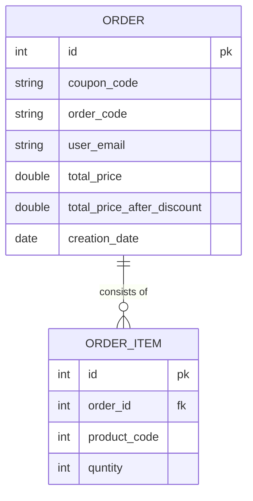

## Description
The Orders API microservice is an important component of our e-commerce platform, designed to efficiently handle the creation, management, and processing of our customers' orders.
And it encapsulates order-related functionalities.
- Note: Its part of a graduation project of Fawry internship.
- All microservices that make the entire ecommerce are here: [fawry final project](https://github.com/Fawry-Project)

## Features ✨

- You can list all of your orders between a start and end date for specific customer email.
- You can create Order with items, card number, cvv, customer email and coupon code.
- Notify Customer and Merchant about the order by Sending notification msg to kafka topic as a producer (notification service consume the msg and send it via `gmail`)
- Ensure proper validation and error handling is implemented for the API endpoints.
- Well-organized and well-documented code.

## API Endpoints

| Methods | Endpoints                                |
| :------ | :--------------------------------------- |
| `POST`  | `/orders/complete-checkout `      |
| `GET`   | `/orders/by-email-and-range-date `|


## Test the API here:
- [API DOC](http://localhost:8080/v3/api-docs)
- [Swagger UI](http://localhost:8080/swagger-ui/index.html)

## Project structure

<details>
<summary>Click to expand!</summary>

```bash
## Project Structure
📦src
 ┣ 📂main
 ┃ ┣ 📂java
 ┃ ┃ ┗ 📂com
 ┃ ┃ ┃ ┗ 📂fawry
 ┃ ┃ ┃ ┃ ┗ 📂orderService
 ┃ ┃ ┃ ┃ ┃ ┣ 📂config
 ┃ ┃ ┃ ┃ ┃ ┃ ┣ 📜KafkaTopicConfig.java
 ┃ ┃ ┃ ┃ ┃ ┃ ┗ 📜WebConfig.java
 ┃ ┃ ┃ ┃ ┃ ┣ 📂controller
 ┃ ┃ ┃ ┃ ┃ ┃ ┗ 📜OrderController.java
 ┃ ┃ ┃ ┃ ┃ ┣ 📂dto
 ┃ ┃ ┃ ┃ ┃ ┃ ┣ 📂coupon
 ┃ ┃ ┃ ┃ ┃ ┃ ┃ ┗ 📜ConsumeCouponRequest.java
 ┃ ┃ ┃ ┃ ┃ ┃ ┣ 📂notification
 ┃ ┃ ┃ ┃ ┃ ┃ ┃ ┗ 📜NotificationRequest.java
 ┃ ┃ ┃ ┃ ┃ ┃ ┣ 📂order
 ┃ ┃ ┃ ┃ ┃ ┃ ┃ ┣ 📜OrderItemRequest.java
 ┃ ┃ ┃ ┃ ┃ ┃ ┃ ┣ 📜OrderRequest.java
 ┃ ┃ ┃ ┃ ┃ ┃ ┃ ┗ 📜OrderResponse.java
 ┃ ┃ ┃ ┃ ┃ ┃ ┣ 📂product
 ┃ ┃ ┃ ┃ ┃ ┃ ┃ ┗ 📜ProductConsumptionRequest.java
 ┃ ┃ ┃ ┃ ┃ ┃ ┣ 📂stock
 ┃ ┃ ┃ ┃ ┃ ┃ ┃ ┗ 📜ConsumeProductRequest.java
 ┃ ┃ ┃ ┃ ┃ ┃ ┗ 📂transaction
 ┃ ┃ ┃ ┃ ┃ ┃ ┃ ┣ 📜DepositRequest.java
 ┃ ┃ ┃ ┃ ┃ ┃ ┃ ┗ 📜WithdrawRequest.java
 ┃ ┃ ┃ ┃ ┃ ┣ 📂entity
 ┃ ┃ ┃ ┃ ┃ ┃ ┣ 📜Order.java
 ┃ ┃ ┃ ┃ ┃ ┃ ┗ 📜OrderItem.java
 ┃ ┃ ┃ ┃ ┃ ┣ 📂exception
 ┃ ┃ ┃ ┃ ┃ ┃ ┣ 📜ErrorResponse.java
 ┃ ┃ ┃ ┃ ┃ ┃ ┗ 📜GlobalExceptionHandler.java
 ┃ ┃ ┃ ┃ ┃ ┣ 📂mapper
 ┃ ┃ ┃ ┃ ┃ ┃ ┣ 📜OrderItemMapper.java
 ┃ ┃ ┃ ┃ ┃ ┃ ┗ 📜OrderMapper.java
 ┃ ┃ ┃ ┃ ┃ ┣ 📂repository
 ┃ ┃ ┃ ┃ ┃ ┃ ┗ 📜OrderRepo.java
 ┃ ┃ ┃ ┃ ┃ ┣ 📂service
 ┃ ┃ ┃ ┃ ┃ ┃ ┣ 📜OrderService.java
 ┃ ┃ ┃ ┃ ┃ ┃ ┗ 📜OrderServiceImp.java
 ┃ ┃ ┃ ┃ ┃ ┣ 📜OrderServiceApplication.java
 ┃ ┃ ┃ ┃ ┃ ┣ 📜RestTemplateClient.java
 ┃ ┃ ┃ ┃ ┃ ┗ 📜Utils.java
 ┃ ┗ 📂resources
 ┃ ┃ ┣ 📂db
 ┃ ┃ ┃ ┗ 📂migration
 ┃ ┃ ┃ ┃ ┣ 📜V1__Order_DB.sql
 ┃ ┃ ┃ ┃ ┣ 📜V2__Order_DB.sql
 ┃ ┃ ┃ ┃ ┗ 📜V3__Add_Order_Code_Field.sql
 ┃ ┃ ┣ 📂static
 ┃ ┃ ┣ 📂templates
 ┃ ┃ ┗ 📜application.properties
 ┗ 📂test
 ┃ ┗ 📂java
 ┃ ┃ ┗ 📂com
 ┃ ┃ ┃ ┗ 📂fawry
 ┃ ┃ ┃ ┃ ┗ 📂orderService
 ┃ ┃ ┃ ┃ ┃ ┗ 📜OrderServiceApplicationTests.java
```

</details>

## Database Schema



## Requirements
- Java Development Kit (JDK) 17 or above
- PostgreSQL Database (You can either use a local PostgreSQL instance or connect to a remote one)
- Maven

## Installation 📥


```bash
> git clone https://github.com/AbdelrahmanShaheen/order-service-api/
> cd order-service-api/
> mvn clean install
```

## How to use

Edit the database configurations in application.properties file.
Build and run the application using Maven:

```bash
> mvn spring-boot:run
```

the backend server will be running on the specified port on your application.properties file.

## Running Tests 🧪
- To run unit tests:
```shell
mvn test        
```
- To run Integration tests:
```shell
mvn verify        
```


## Tech/Framework used 🧰

- Java
- Spring Boot
- Spring Data JPA
- Kafka
- PostgreSQL
- Flyway for db miagrations
- Docker
- Lombok
- Maven 
- Swagger
- Intellij
- Junit & Mockito

## ToDo

###### Here are some features that i 'll implement soon:

- [ ] Apply SAGA for distributed transactions. 
